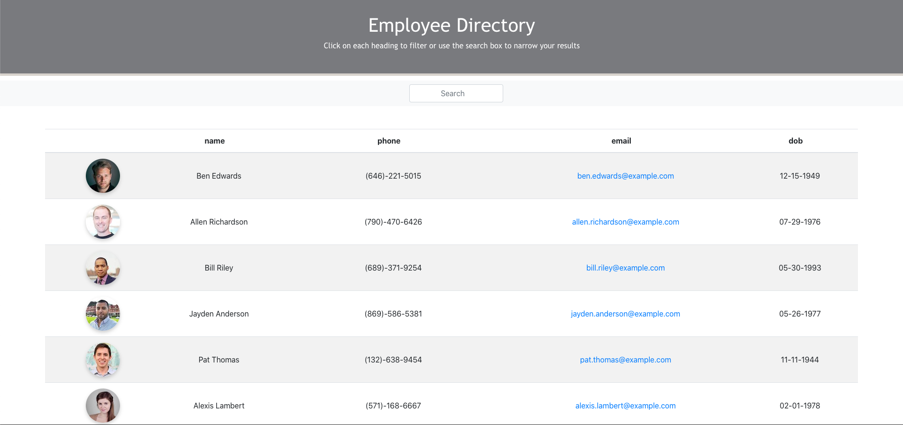

# Employee-Directory

## Table of Contents

- [Description](#description)
- [Installation](#install)
- [Usage](#usage)
- [Licences](#licences)
- [Questions](#questions)

## Description

A React employee directory that allows the user to view all employees at once and have quick access to their information.

## Install

* Git Clone https://github.com/chaseyb/Employee-directory
* `npm install`
* `npm start`
* Enjoy on http://localhost:3000/

## Usage

When using this web application the user will be able to search and sort employees by Name, Email, and DOB.

## Licences

## Heroku Demo

[Heroku link](https://employee-directory-9000.herokuapp.com/ "Heroku Link")

## Questions?

- [Chaseyb](https://github.com/Chaseyb)
- <Chase.b.johnson@gmail.com>

  
